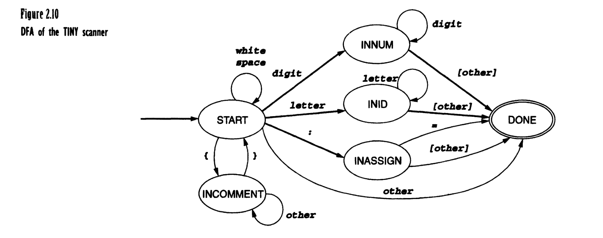
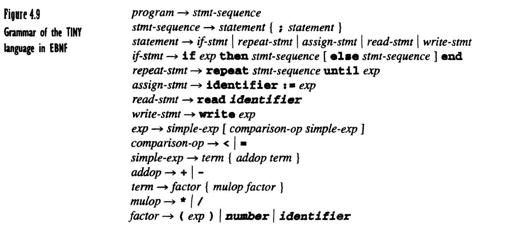
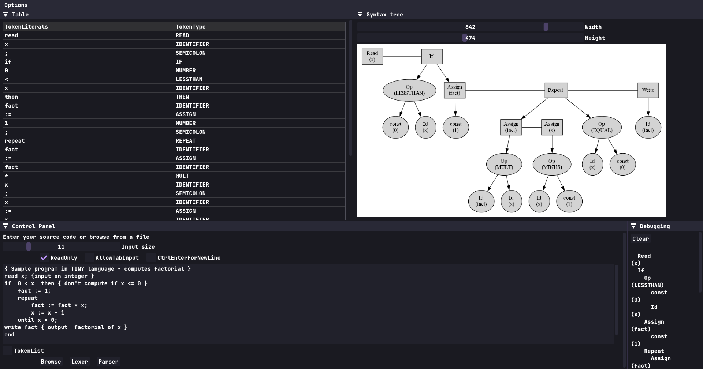

# TINY Language Scanner and Parser
* A program in TINY has a very simple structure:
    * it is just a sequence of statements separated by semicolons.
    * There are no procedures and no declarations.
    * All variables are integer variables, and variables are declared simply by assigning values to them.
* There are only two control statements:
    * an if-statement and a repeat-statement.
    * Both control statements may themselves contain statement sequences.
    * An if-statement has an optional else part and must be terminated by the keyword end.
    * There are also read and write statements that perform input/output.
* Comments are allowed within curly brackets; comments cannot be nested.
* Expressions in TINY are also limited to Boolean and integer arithmetic expressions.
    * A Boolean expression consists of a comparison of two arithmetic expressions using either of the two comparison operators < and =.
    * An arithmetic expression may involve integer constants, variables, parentheses, and any of the four integer operators `+`, `-`, `*` and `/`(integer division), with the usual mathematical properties. 
    * Boolean expressions may appear only as tests in control statements-there are no Boolean variables, assignment, or I/O.

---
* From the book **Compiler Construction: Principles and Practice (1997)** by Kenneth C. Louden 
---
## TINY Scanner

  

## TINY Parser

  

--- 

## Usage
1. Compile using either the `Makefile` or included batch file `run.bat`
2. Open `GUI.exe`

  

